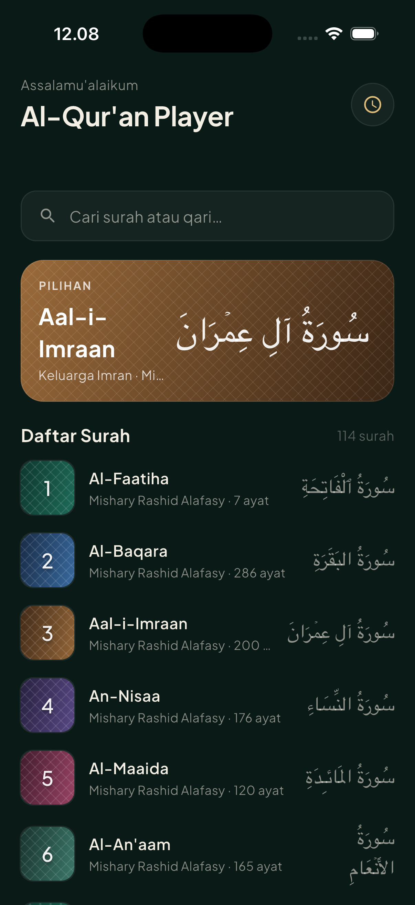
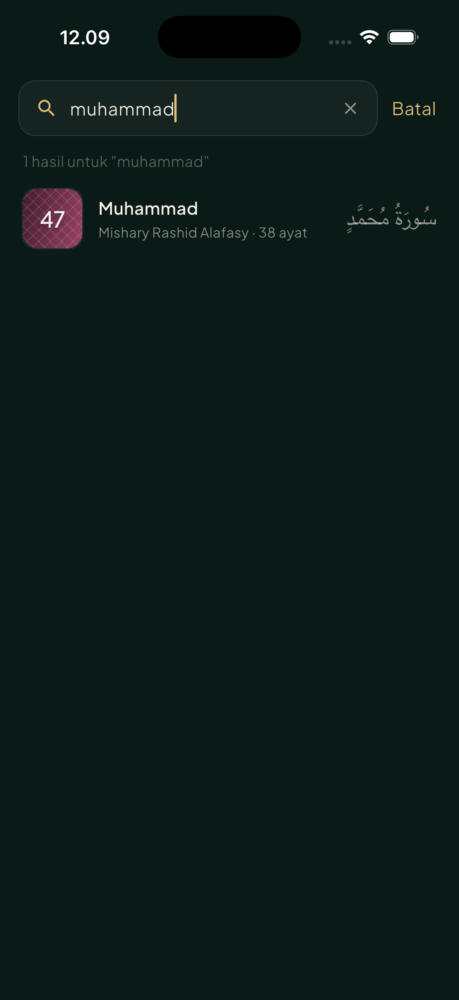
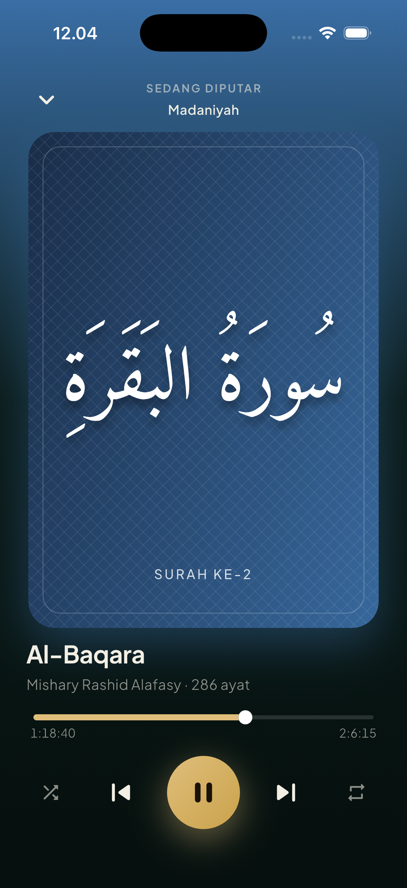
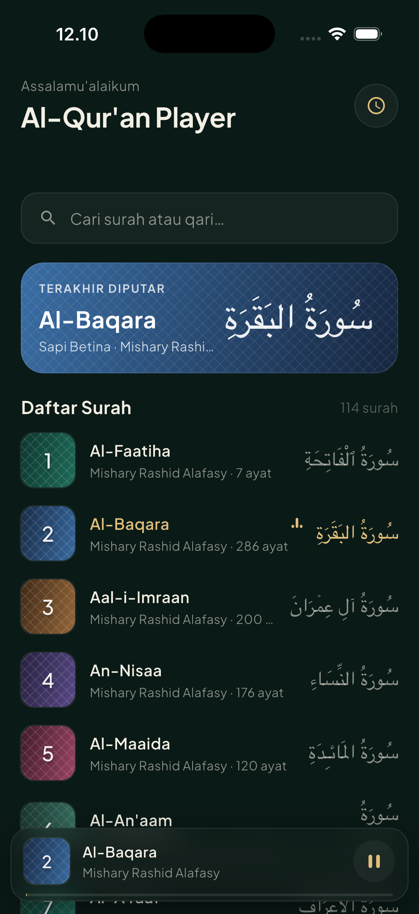

# Al-Qur'an Player 🎧

A mobile **audio player for the Holy Qur'an** built with Flutter, using the
public [AlQuran Cloud API](https://alquran.cloud). It reframes a music-player as
a murottal player: **surahs are the “songs”** and **reciters (qaris) are the
“artists.”**

Built for a mobile technical test, with emphasis on **clean architecture**,
**BLoC** state management, **Dio** networking, and a polished, calm UI
(dark emerald + gold).

---

## 📌 Concept mapping

| Music player        | This app                          |
| ------------------- | --------------------------------- |
| Song / track        | **Surah**                         |
| Artist              | **Reciter / Qari**                |
| Album art           | Gradient cover + Arabic numeral   |
| Stream URL          | Full-surah MP3 (islamic.network)  |
| Playlist            | All 114 surahs                    |

---

## ✨ Features

- **Search** surahs by title, Indonesian meaning, Arabic name, or reciter.
- **Playback control** — play / pause / resume.
- **Progress display** — current position & total duration with a progress bar.
- **Seeking** — drag the slider to jump anywhere in the recitation.
- **Now-Playing screen** with large artwork, controls, shuffle & repeat.
- **Persistent mini-player** across the app.
- **Auto-advance** to the next surah when one finishes (repeat / shuffle aware).
- **Recently played** history sheet.
- **Background playback** + lock-screen / notification controls
  (`just_audio_background`).
- **Custom splash screen** (Flutter widget) and **custom app icon**
  (mihrab arch + gold equalizer).

---

## 📸 Visual documentation

| Home | Search |
| ---- | ------ |
|  |  |

| Now Playing | Mini player |
| ----------- | ----------- |
|  |  |

**Screen recording:**

[](https://raw.githubusercontent.com/fandiidnaf/quran_player/main/docs/screenshots/demo.mov)


---

## 🏛 Architecture

**Clean Architecture, per feature.** Each feature owns three layers:

```
lib/
├── core/                         # cross-cutting concerns
│   ├── constants/                # colors, API endpoints, reciters, surah names
│   ├── di/                       # get_it service locator
│   ├── error/                    # Failure hierarchy
│   ├── network/                  # Dio client
│   ├── router/                   # go_router config
│   └── theme/                    # app theme
└── features/
    ├── surah_list/               # browse the 114 surahs  (the "library")
    │   ├── data/                 #   models · datasources (Dio) · repo impl
    │   ├── domain/               #   entity · repository contract · usecases
    │   └── presentation/         #   bloc · pages · widgets
    ├── search/                   # filter surahs (title / artist)
    │   └── presentation/         #   bloc · page
    ├── player/                   # audio playback  (the "player")
    │   ├── data/                 #   audio datasource (just_audio) · repo impl
    │   ├── domain/               #   entity · repository contract · usecases
    │   └── presentation/         #   bloc · page · widgets
    └── splash/                   # custom splash screen
```

**Dependency rule:** `presentation → domain ← data`. The domain layer is pure
Dart (no Flutter, no Dio, no just_audio); outer layers depend inward via
abstract contracts, wired together with `get_it`.

### Data flow (example: play a surah)

```
SurahRow tap
  → PlayerBloc.add(PlaySurahEvent)
    → PlaySurahUseCase
      → PlayerRepository (contract)
        → AudioDataSource (just_audio)
          ⟲ position/duration/playing/loading streams
        ← Either<Failure, void>
      ← bloc maps streams → PlayerState
  → BlocBuilder rebuilds the UI
```

Errors are modeled with **`Either<Failure, T>`** (`fpdart`) instead of throwing
across layers, so the UI handles success/failure explicitly.

---

## 🧠 State management (BLoC)

| Bloc            | Responsibility                                                    |
| --------------- | ---------------------------------------------------------------- |
| `SurahListBloc` | Loads the 114 surahs → `Initial / Loading / Loaded / Error`.      |
| `SearchBloc`    | Holds the pool + the live-filtered results as the query changes.  |
| `PlayerBloc`    | The audio engine’s single source of truth: current surah, play/pause, position, duration, loading, shuffle, repeat, history. It listens to five just_audio streams and turns them into a single `PlayerState`. |

The `PlayerBloc` is the heart of the app — it stops the previous track before
loading the next, falls back to a reliable reciter edition if a file is missing,
and auto-advances on completion.

---

## 🌐 API & audio

- **Surah list:** `GET https://api.alquran.cloud/v1/surah`
- **Full-surah audio:**
  `https://cdn.islamic.network/quran/audio-surah/128/{edition}/{number}.mp3`

> **Note on reciters:** the free full-surah CDN reliably serves only
> **Mishary Rashid Alafasy** (`ar.alafasy`). To keep the displayed qari honest
> (matching the audio you actually hear), all surahs currently use Alafasy.
> The reciter list in `core/constants/reciters.dart` is structured so additional
> qaris can be enabled the moment a working multi-reciter source is wired in.

---

## 🧰 Tech stack

| Concern            | Package                          |
| ------------------ | -------------------------------- |
| State management   | `flutter_bloc`                   |
| Networking         | `dio`                            |
| Audio              | `just_audio` + `just_audio_background` |
| Routing            | `go_router`                      |
| DI                 | `get_it`                         |
| FP / error model   | `fpdart`                         |
| Value equality     | `equatable`                      |
| Fonts              | `google_fonts`                   |
| Concurrency guard  | `synchronized`                   |
| Icon / splash gen  | `flutter_launcher_icons`, `flutter_native_splash` |

---

## ▶️ Getting started

```bash
flutter pub get
flutter run
```

---

## ✅ Testing

This project ships **unit tests** (use cases, models, repositories, data
sources, and every bloc) and **widget tests** (cover, surah row, seek bar).

Add these to `dev_dependencies` in `pubspec.yaml`:

```yaml
dev_dependencies:
  flutter_test:
    sdk: flutter
  bloc_test: ^9.1.7
  mocktail: ^1.0.4
```

Run them:

```bash
flutter test                 # all tests
flutter test --coverage      # with coverage → coverage/lcov.info
```

```
test/
├── helpers/test_data.dart                         # shared fixtures
├── core/constants/                                # api_constant, reciters
└── features/
    ├── surah_list/
    │   ├── domain/usecases/get_all_surahs_test.dart
    │   ├── data/models/surah_model_test.dart
    │   ├── data/datasources/surah_remote_datasource_test.dart
    │   ├── data/repositories/surah_repository_impl_test.dart
    │   └── presentation/
    │       ├── bloc/surah_list_bloc_test.dart
    │       └── widgets/{cover_widget,surah_row}_test.dart
    ├── search/presentation/bloc/search_bloc_test.dart
    └── player/
        ├── presentation/bloc/player_bloc_test.dart
        └── presentation/widgets/seek_bar_test.dart
```

> The tests import the package as `package:quran_player/...`. If your
> `pubspec.yaml` `name:` differs, update the imports accordingly.

---

## 📄 License

MIT LICENSE
